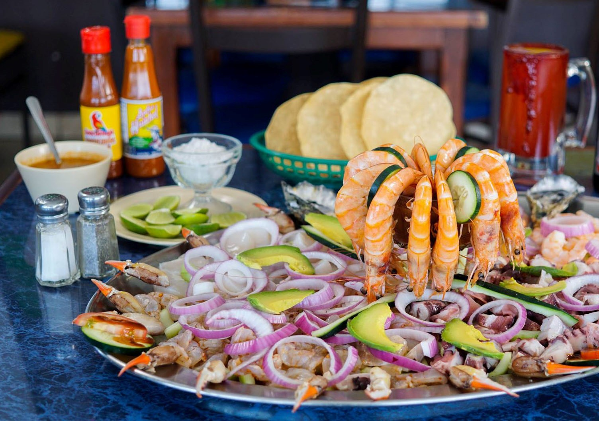

<!DOCTYPE html>
<html lang="en">
    <head>
        <meta charset="UTF-8">
        <meta name="viewport" content="width=device-width, initial-scale=1.0">
        <title>La Chiquita</title>
        <!-- Font -->
        <link href="https://fonts.googleapis.com/css2?family=Oswald:wght@300;400;500&display=swap" rel="stylesheet">
        <!-- Font Awesome -->
        <link rel="stylesheet" href="https://cdnjs.cloudflare.com/ajax/libs/font-awesome/5.13.0/css/all.min.css">
        <!--  CSS -->
        <link rel="stylesheet" href="css/styles.css">
    </head>
    <body>
            

              <i class="fas fa-bars fa-2x"></i>
            

          
            

              <!-- Navigation -->
              <nav class="nav-main">
                <!-- Brand -->
                
                <!-- Left Nav -->
                <ul class="nav-menu">
                  <li><a href="index.html">Inicio</a></li>
                  <li><a href="source/menu.html">Menu</a></li>
                  <li><a href="source/nosotros.html">Nosotros</a></li>
                  <li><a href="source/reservaciones.html">Reservaciones</a></li>
                  <li><a href="source/sucursales.html">Sucursales</a></li>
                </ul>
          
                <!-- Right Nav -->
                <ul class="nav-menu-right">
                  <li>
                    <a href="#">
                      <i class="fas fa-search"></i>
                    </a>
                  </li>
                </ul>
              </nav>
              

          
              <!-- SHOWCASE -->
              <header class="showcase">
                <h2>¡El sabor orignal del mar!</h2>
                
Con el único objetivo de hacerte sentir como en casa, fonda "La Chiquita" trae para ti el autentico
                  sabor de la costa y el trato especial que te mereces.
                

                
Has tu reservación y ven a conocernos.

                <a href="reservaciones.html" class="btn">
                  Reservaciones <i class="fas fa-chevron-right"></i>
                </a>
              </header>
          
              <!-- Promociones nuevas -->
              

                

                  
                  <h3>Camarones de la casa.</h3>
                  
Consiste en camarones dorados y bañados en ajo y limón con salsa al gusto, son acompañados por gran variedad 
                    de alimentos como arroz blanco, frijoles, ensalada entre otros y el ingrediente secreto de La Chiquita que lo hacen un platillo único en la región.
                  

                  <a href="source/menu.html">Ir al menú <i class="fas fa-angle-double-right"></i></a>
                

                

                  
                  <h3>Pescado asado.</h3>
                  
Preparación de pescado cocido sobre una parrilla al calor de las brasas de madera o carbón acompañado de distintos platillos
                    y por su puesto con el toque de la casa que lo hace aún más delicioso.
                  

                  <a href="source/menu.html">Ir al menú <i class="fas fa-angle-double-right"></i></a>
                

                

                  
                  <h3>Aguachile.</h3>
                  
platillo en el que se pueden encontrar distintos sabores, tales como los ácidos y pungentes. La característica de un buen 
                    aguachile es la combinación de agua, chile chiltepín, cebolla fileteada, sal, y pepinos cortados para servir.
                  

                  <a href="source/menu.html">Ir al menú <i class="fas fa-angle-double-right"></i></a>
                

                

                  
                  <h3>Pulpo en su jugo.</h3>
                  
Una manera diferente de preparar este molusco y, que sin duda, sorprenderá a todos. Se trata de cocer un pulpo y después 
                    hacerlo a la plancha. Como resultado, se caramelizará en su exterior, manteniéndose caliente, y dando una textura diferente al típico pulpo cocido.
                  

                  <a href="source/menu.html">Ir al menú <i class="fas fa-angle-double-right"></i></a>
                

              

          
              <!-- Suscripcion-->
              <section class="cards-banner-one">
                

                  <h2>Que la diversión nunca termine.</h2>
                  <!-- lorem 20 -->
                  
Suscribete a nuestro newsletter y recibe nuestras más exclusivas promociones y descuentos
                    que solamente nuestra chiquita familia se merece.
                  

                  <a href="img/promotion.htm" class="btn">Suscribete<i class="fas fa-chevron-right"></i></a>
                

              </section>
          
              <!-- third card -->
              <section class="cards-banner-two">
                

                  <h2>Conoce nuestras sucursales.</h2>
                  <!-- lorem 30 -->
                  
Porque sabemos que nunca está de más una escapada al mar, tenemos una sucursal cerca de ti.

                  <a href="sucursales.html" class="btn">Sucursales <i class="fas fa-chevron-right"></i></a>
                

              </section>
          
              <!-- Follow -->
              <section class="social">
                
Compartenos tu experiencia en nuestras redes sociales

                

                  <a href="https://facebook.com">
                    <i class="fab fa-facebook-f"></i>
                  </a>
                  <a href="https://twitter.com">
                    <i class="fab fa-twitter"></i>
                  </a>
                  <a href="https://instagram.com">
                    <i class="fab fa-instagram"></i>
                  </a>
                

              </section>
            

          
            <!-- Footer Links -->
            

              

                <ul>
                  <li>
                    <h3>Enlaces rápidos</h3>
                  </li>
                  <li>
                    <a href="nosotros.html">Nosotros</a>
                  </li>
                  <li>
                    <a href="sucursales.html">Sucursales</a>
                  </li>
                  <li>
                    <a href="contacto.html">Contactanos</a>
                  </li>
                </ul>
                <ul>
                  <li>
                    <h3>Otros enlaces</h3>
                 </li>
                  <li>
                    <a href="privacidad.html">Aviso de Privacidad</a>
                  </li>
                  <li>
                    <a href="preguntas-frecuentes.html">Preguntas frecuentes</a>
                  </li>
                </ul>
              

            

          
            <!-- Footer -->
            <footer class="footer">
              <h3>La Chiquita Copyright 2021 Todos los derechos reservados</h3>
            </footer>
          
            <!-- Scroll Reveal -->
            
            
         
    </body>
</html>
